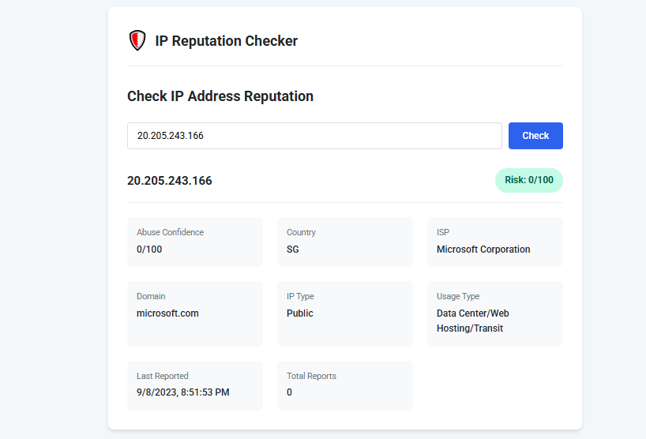

# IP Abuse Checker 🛡️

 

A web-based tool to check the reputation of any IP address against AbuseIPDB's database of malicious actors. Designed for cybersecurity professionals, network admins, and developers.

## Features ✨

- **Instant Risk Assessment**: Get abuse confidence scores (0-100%) for any IPv4 address
- **Comprehensive Reporting**:
  - ISP and geographic data
  - Historical abuse reports
  - Usage type classification
- **Professional Dashboard**:
  - Color-coded risk indicators
  - Responsive design for all devices
  - Interactive IP search

## How It Works ⚙️

1. **Frontend**: HTML/jQuery interface
   - User input validation
   - Dynamic results display
   - Error handling

2. **Backend**: PHP proxy server
   - Securely communicates with AbuseIPDB API
   - Prevents CORS issues
   - Protects API keys

## Installation 🚀

### Requirements
- Web server with PHP (Apache/Nginx)
- AbuseIPDB API key (free tier available)

### Setup
1. Clone this repository:
   ```bash
   git clone https://github.com/42webok/IP-Address-Reputation.git
